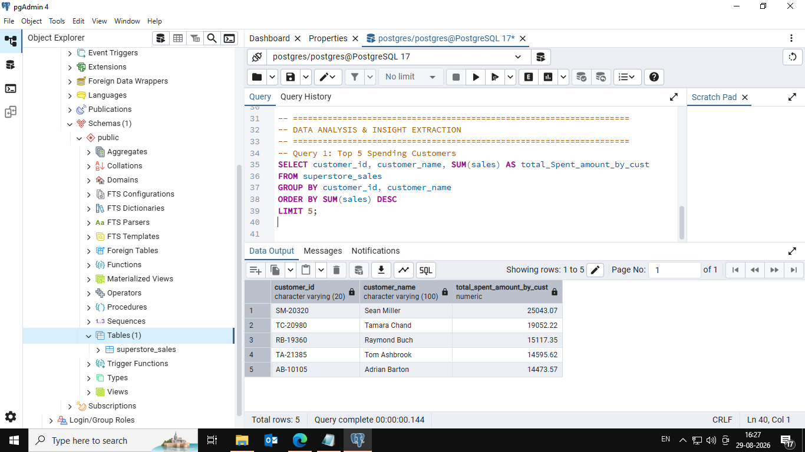
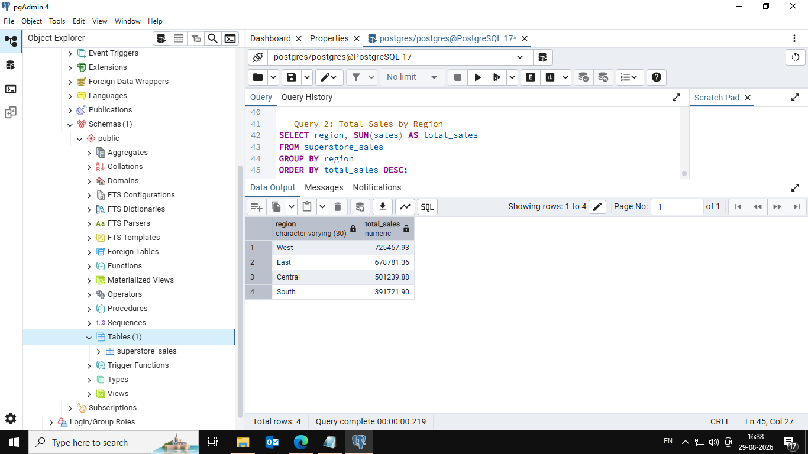
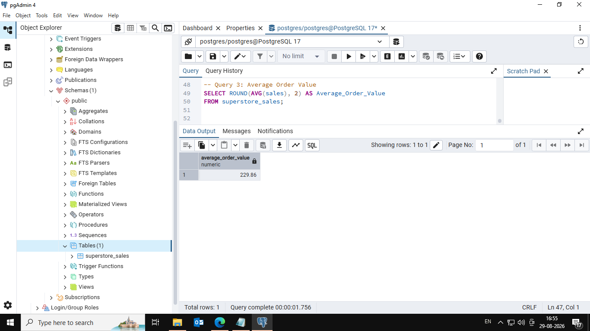
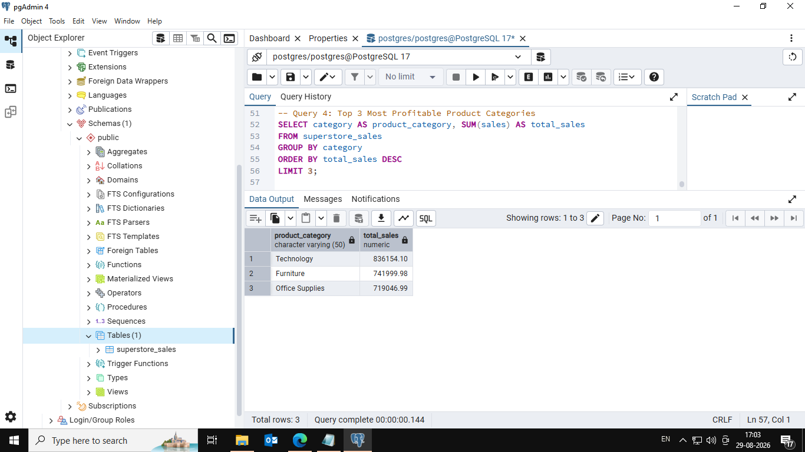

# Original internship results

These screenshots preserve the original Task 2 submission. They do not show execution of the revised `analysis.sql` queries.

## Top five customers by total sales

## Regional sales
The original result shows West with the highest sales (725,457.93) and South with the lowest (391,721.90). Currency was not specified in the source folder.

## Average sales per row
The original heading calls this average order value, but AVG(sales) measures the average line value (229.86 in the screenshot). The revised query first aggregates rows into orders.

## Categories ranked by sales
The original heading says profitable categories, but SUM(sales) ranks revenue: Technology, Furniture, then Office Supplies. The revised query uses SUM(profit).

## Shipping mode by row count
Standard Class has 5,968 rows in the original result. Without shipment identifiers, this is not proof of 5,968 shipments. The revised version counts distinct orders per mode.

